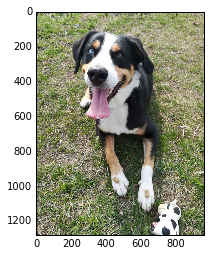

# Deep Learning Nanodegree Foundation

This repository contains material related to Udacity's [Deep Learning Nanodegree Foundation](https://www.udacity.com/course/deep-learning-nanodegree-foundation--nd101) program. It consists of a bunch of tutorial notebooks for various deep learning topics. In most cases, the notebooks lead you through implementing models such as convolutional networks, recurrent networks, and GANs. There are other topics covered such as weight intialization and batch normalization.

There are also notebooks used as projects for the Nanodegree program. In the program itself, the projects are reviewed by Udacity experts, but they are available here as well.

## Table Of Contents


### Projects

* [Your First Neural Network](https://github.com/udacity/deep-learning/tree/master/first-neural-network): Implement a neural network in Numpy to predict bike rentals.

Learn neural networks basics, and build your first network with Python and Numpy. Use modern deep learning frameworks (Keras, TensorFlow) to build multi-layer neural networks, and analyze real data.


* [Dog-Breed Classifier](https://github.com/udacity/deep-learning/tree/master/dog-project): Design and train a convolutional neural network to analyze images of dogs and correctly identify their breeds.

Learn how to build convolutional networks and use them to classify images (faces, melanomas, etc.) based on objects that appear in them. Use these networks to learn data compression and image denoising.

```python
img_path = './test_images/4.jpg'
classify_image(img_path)
```

    Using image path ./test_images/4.jpg
    Dog detected
    64
    ./test_images/4.jpg
    Dear dog, predicted your breed as Entlebucher_mountain_dog for image None
    




* [Text Generation](https://github.com/udacity/deep-learning/tree/master/tv-script-generation): Train a recurrent neural network on scripts from The Simpson's (copyright Fox) to generate new scripts.

Build your own recurrent networks and long short-term memory networks with Keras and TensorFlow; perform sentiment analysis and generate new text. Use recurrent networks to generate new text from TV scripts.

```
INFO:tensorflow:Restoring parameters from ./save
moe_szyslak:(nods) what?
homer_simpson:(to cat) i wish he'd cover ya, moe?
moe_szyslak:(into phone) okay, i think you're talkin'.
homer_simpson:(ominous) unable to move the midnight train to slab city.
homer_simpson:(to moe) i need a little person?
homer_simpson:(tough) oh, i don't know...
homer_simpson:(to moe, disgusted) my thesaurus... now how did you say fat...(looks at thumb) oh, moe. i got a date with my mother's show?
moe_szyslak:(into phone) there's an exit?
moe_szyslak:(into phone) gotcha you a minute of silent prayer for talkin'.
moe_szyslak:(into phone) okay, i think you want to commit a crime, homer?
moe_szyslak:(into phone) okay, i think you could dump my keys?
moe_szyslak:(to harv)


moe_szyslak:(cutting him off) let's get it.
moe_szyslak:(into phone) okay
```

* [Face Generation](https://github.com/udacity/deep-learning/tree/master/face_generation): Use a DCGAN on the CelebA dataset to generate images of novel and realistic human faces.

Build a pair of Multi-Layer Neural Networks and make them compete against each other in order to generate MNIST numbers or realistic faces.
Learn to understand and implement the DCGAN model to simulate realistic images with GANS (generative adversarial networks).


## Dependencies

Each directory has a `requirements.txt` describing the minimal dependencies required to run the notebooks in that directory.

### pip

To install these dependencies with pip, you can issue `pip3 install -r requirements.txt`.

### Conda Environments

You can find Conda environment files for the Deep Learning program in the `environments` folder. Note that environment files are platform dependent. Versions with `tensorflow-gpu` are labeled in the filename with "GPU".