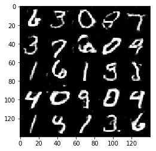
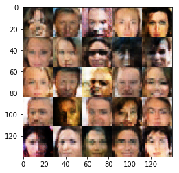

# Face Generation
## Use a DCGAN on the CelebA dataset to generate images of novel and realistic human faces.

Build a pair of Multi-Layer Neural Networks and make them compete against each other in order to generate MNIST numbers or realistic faces.
Learn to understand and implement the DCGAN model to simulate realistic images with GANS (generative adversarial networks).

