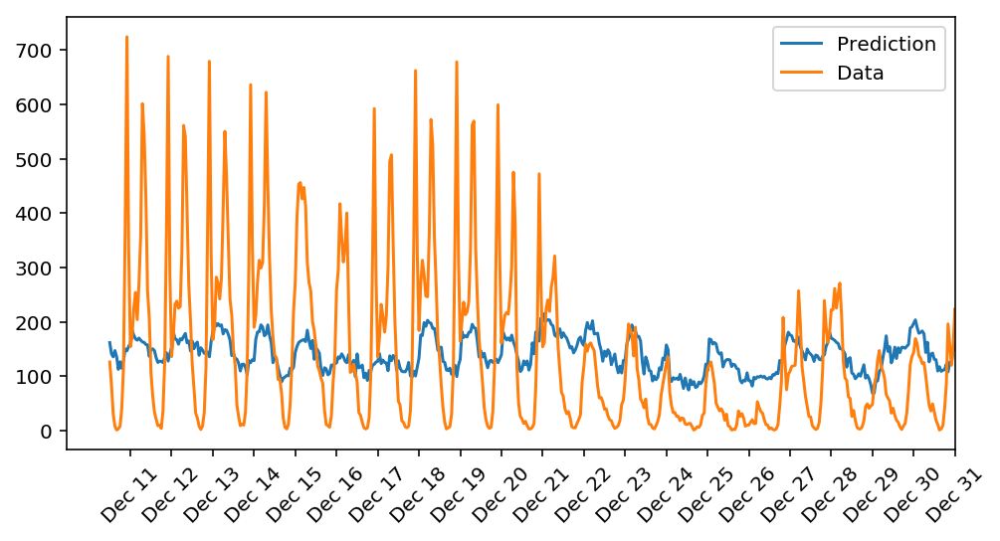

# Your First Neural Network

### Build and train neural networks from scratch to predict the number of bikeshare users on a given day.

Learn neural networks basics, and build your first network with Python and Numpy. Use modern deep learning frameworks (Keras, TensorFlow) to build multi-layer neural networks, and analyze real data.

